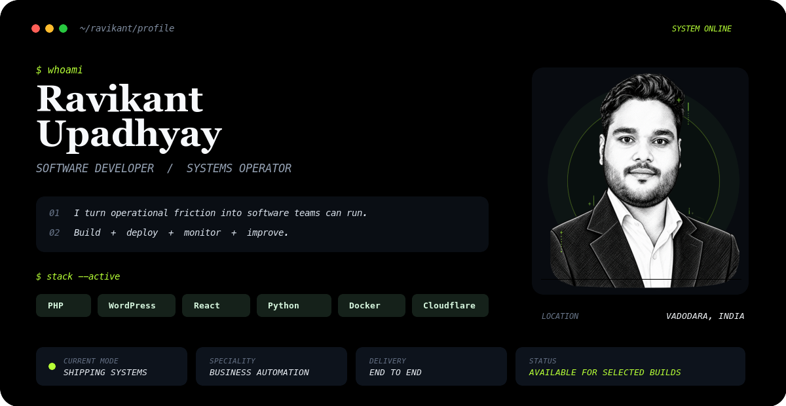

<p align="center">
  
</p>

<p align="center">
  <a href="https://ravikant-1811.vercel.app/"></a>
  <a href="https://www.linkedin.com/in/ravikant-upadhyay"></a>
  <a href="mailto:nravikant123@gmail.com"></a>
  <a href="https://x.com/Mr_RK_1811"></a>
</p>

```console
ravikant@github:~$ cat mission.txt
Build practical software for messy, real-world operations.
Own the path from first workflow map to production monitoring.
```

## `>_ ./systems --featured`

| ID | System | Operational outcome | Core stack |
|:--:|---|---|---|
| `01` | [**Taskflow**](https://github.com/Ravikant-1811/Taskflow-PHP) | Multi-tenant task and workspace operations for teams | `PHP` `SQLite` `JavaScript` |
| `02` | [**Multi-User Communication Platform**](https://github.com/Ravikant-1811/Multi-User-PHP-Web-Application) | Role-based admin/client dashboards and live communication | `PHP` `MySQL` `AJAX` |
| `03` | [**WhatsApp Campaign Console**](https://github.com/Ravikant-1811/Whatsapp-Bulk-Bot) | Campaign queues, templates, scheduling, and delivery logs | `PHP` `Messaging` `Automation` |
| `04` | [**Vakify AI 2.0**](https://github.com/Ravikant-1811/vakify-ai-2.0) | AI-assisted learning, coding labs, quizzes, and progress loops | `React` `TypeScript` `Flask` `AI` |
| `05` | [**Digital Card Generator**](https://github.com/Ravikant-1811/Digital-Card-Generator) | Fast creation and sharing of managed professional cards | `PHP` `SQLite` |
| `06` | [**Find Business**](https://github.com/Ravikant-1811/find-business) | Business discovery, listing submissions, and lead collection | `PHP` `MySQL` |

<p align="right"><a href="https://github.com/Ravikant-1811?tab=repositories"><strong>OPEN ALL REPOSITORIES &rarr;</strong></a></p>

## `>_ ./capabilities --list`

| `BUILD` | `AUTOMATE` |
|---|---|
| Business applications, CRM systems, task platforms, portals, authentication, reporting, and APIs. | Messaging tools, content pipelines, scheduled jobs, AI integrations, webhooks, and workflow automation. |

| `DELIVER` | `OPERATE` |
|---|---|
| Custom WordPress builds, Elementor and ACF systems, WooCommerce changes, performance, and maintenance. | Linux, PM2, Cloudflare, Docker, Vercel, monitoring, diagnostics, and production recovery. |

<p align="center">
  
</p>

## `>_ ./activity --live`

<p align="center">
  
</p>

<p align="center">
  
  
</p>

<picture>
  <source media="(prefers-color-scheme: dark)" srcset="https://raw.githubusercontent.com/Ravikant-1811/Ravikant-1811/output/github-snake-dark.svg" />
  <source media="(prefers-color-scheme: light)" srcset="https://raw.githubusercontent.com/Ravikant-1811/Ravikant-1811/output/github-snake.svg" />
  
</picture>

## `>_ ./principles`

```text
[01] Build for real workflows, permissions, handoffs, and edge cases.
[02] Make system state visible so teams know what needs attention.
[03] Treat code, deployment, monitoring, and support as one outcome.
```

## `>_ ./connect --open`

Have a useful problem involving a business workflow, WordPress platform, automation, or custom application?

**[VIEW PORTFOLIO](https://ravikant-1811.vercel.app/)** &nbsp; / &nbsp; **[CONNECT ON LINKEDIN](https://www.linkedin.com/in/ravikant-upadhyay)** &nbsp; / &nbsp; **[SEND AN EMAIL](mailto:nravikant123@gmail.com)**

<sub>RAVIKANT UPADHYAY &nbsp; // &nbsp; SOFTWARE DEVELOPER + SYSTEMS OPERATOR &nbsp; // &nbsp; VADODARA, INDIA</sub>
