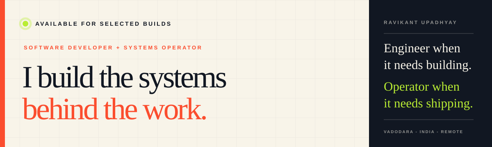

<p align="center">
  
</p>

<p align="center">
  <a href="https://ravikant-1811.vercel.app/"><strong>Portfolio</strong></a>
  &nbsp;&middot;&nbsp;
  <a href="https://www.linkedin.com/in/ravikant-upadhyay"><strong>LinkedIn</strong></a>
  &nbsp;&middot;&nbsp;
  <a href="mailto:nravikant123@gmail.com"><strong>Email</strong></a>
  &nbsp;&middot;&nbsp;
  <a href="https://x.com/Mr_RK_1811"><strong>X</strong></a>
</p>

## I build the systems behind the work.

I am a software developer based in Vadodara, India. I turn operational friction - scattered spreadsheets, manual follow-ups, disconnected dashboards, and repetitive content work - into software that teams can actually run.

My work sits across **PHP business applications, WordPress delivery, automation, AI-assisted workflows, and production operations**. I care about the full outcome: implementation, deployment, reliability, and the people using it after launch.

```text
CURRENT ROLE     Software Developer - Zeusinfinity Services
CORE WORK        Business apps - CRM workflows - WordPress - Automation
OPERATING FROM   Vadodara, India - Remote-friendly
STATUS           Available for selected builds and collaborations
```

## Selected systems

| | Project | What it solves | Built with |
|---|---|---|---|
| `01` | [**Taskflow**](https://github.com/Ravikant-1811/Taskflow-PHP) | Multi-tenant task and workspace operations for teams | PHP - SQLite - JavaScript |
| `02` | [**Multi-User Communication Platform**](https://github.com/Ravikant-1811/Multi-User-PHP-Web-Application) | Secure role-based admin/client dashboards and live communication | PHP - MySQL - AJAX |
| `03` | [**WhatsApp Campaign Console**](https://github.com/Ravikant-1811/Whatsapp-Bulk-Bot) | Controlled campaign queues, templates, scheduling, and delivery logs | PHP - Messaging automation |
| `04` | [**Vakify AI 2.0**](https://github.com/Ravikant-1811/vakify-ai-2.0) | AI-assisted learning, coding labs, quizzes, and progress loops | React - TypeScript - Flask - AI |
| `05` | [**Digital Card Generator**](https://github.com/Ravikant-1811/Digital-Card-Generator) | Managed professional cards that can be created and shared quickly | PHP - SQLite |
| `06` | [**Find Business**](https://github.com/Ravikant-1811/find-business) | Business discovery, listing submissions, and lead collection | PHP - MySQL |

<p align="right"><a href="https://github.com/Ravikant-1811?tab=repositories"><strong>Explore all repositories &rarr;</strong></a></p>

## Capabilities

| Business applications | WordPress delivery |
|---|---|
| Admin dashboards, CRM systems, task platforms, portals, authentication, reporting, and APIs. | Custom WordPress builds, Elementor and ACF systems, WooCommerce changes, performance, and maintenance. |

| Automation systems | Deployment and reliability |
|---|---|
| Messaging tools, content pipelines, scheduled work, AI integrations, webhooks, and workflow automation. | Linux, PM2, Cloudflare, Docker, Vercel, monitoring, diagnostics, and production recovery. |

**Languages and backend**<br>
`PHP` `JavaScript` `TypeScript` `Python` `Node.js` `MySQL` `SQLite` `PostgreSQL`

**Web and platforms**<br>
`React` `Next.js` `WordPress` `WooCommerce` `Elementor` `ACF` `REST APIs`

**Operations**<br>
`Linux` `Cloudflare` `Docker` `PM2` `Vercel` `GitHub Actions` `Monitoring`

## GitHub activity

<p align="center">
  
</p>

<p align="center">
  
  
</p>

<picture>
  <source media="(prefers-color-scheme: dark)" srcset="https://raw.githubusercontent.com/Ravikant-1811/Ravikant-1811/output/github-snake-dark.svg" />
  <source media="(prefers-color-scheme: light)" srcset="https://raw.githubusercontent.com/Ravikant-1811/Ravikant-1811/output/github-snake.svg" />
  
</picture>

## Working principles

- **Build for the messy middle.** Permissions, edge cases, handoffs, maintenance, and real-world usage matter after the demo.
- **Make operations visible.** Good systems show what is happening, what needs attention, and who owns the next step.
- **Ship the whole outcome.** Code, deployment, monitoring, documentation, and support belong to the same deliverable.

## Let's make it work

Have a useful problem involving a business workflow, WordPress platform, automation, or custom application?

**[View the portfolio](https://ravikant-1811.vercel.app/)** &middot; **[Connect on LinkedIn](https://www.linkedin.com/in/ravikant-upadhyay)** &middot; **[Email me](mailto:nravikant123@gmail.com)**

<sub>Software developer - Systems operator - Vadodara, India</sub>
